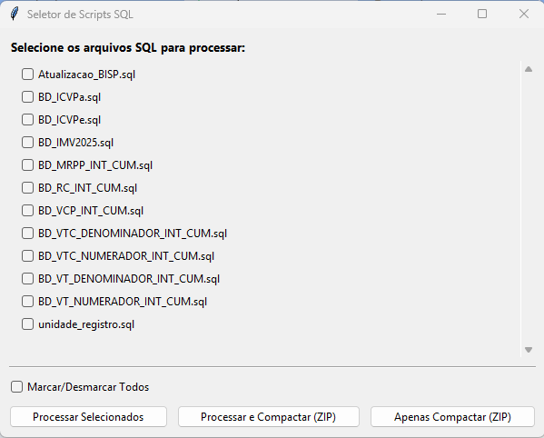

# Executor de Consultas SQL para Impala (GDO Rural MAMB)

Este projeto consiste em uma ferramenta com interface gráfica desenvolvida em Python para automatizar a execução de múltiplos scripts SQL em um banco de dados Impala. A aplicação permite que o usuário selecione quais relatórios deseja gerar, executa as consultas e salva os resultados em arquivos CSV, com a opção de compactar a pasta de resultados em um arquivo ZIP.

## ✨ Funcionalidades

-   **Interface Gráfica:** Janela interativa para selecionar os scripts SQL a serem executados.
-   **Seleção Múltipla:** Permite marcar/desmarcar todos os scripts ou escolher arquivos específicos.
-   **Processamento em Lote:** Executa todas as consultas selecionadas de uma só vez.
-   **Exportação para CSV:** Salva o resultado de cada consulta em um arquivo `.csv` individual, nomeado a partir do arquivo `.sql` de origem.
-   **Compactação (ZIP):** Oferece a opção de compactar a pasta de resultados `csv` após o processamento ou de forma avulsa.
-   **Configuração Segura:** Utiliza variáveis de ambiente (`.env`) para gerenciar as credenciais do banco de dados de forma segura, sem expô-las no código.

## 📂 Estrutura do Projeto

A organização das pastas e arquivos deve seguir a estrutura abaixo para que o script funcione corretamente:

```
E:\GDO_RURAL_MAMB\
│
├── .env                  # Arquivo para credenciais (NÃO ENVIAR PARA O GIT)
├── .gitignore            # Arquivo para ignorar o .env, venv, etc.
├── assets/               # Pasta para imagens e outros recursos
│   └── TelaSelecao.png   # Screenshot da aplicação
│
├── csv/                  # Pasta onde os resultados .csv são salvos
│
├── sql_scripts/          # Pasta contendo todos os scripts .sql
│   ├── BD_ICVPa.sql
│   └── outro_relatorio.sql
│
├── testador_sql.py       # O script principal da aplicação
└── requirements.txt      # Lista de dependências Python do projeto
```

## ⚙️ Pré-requisitos

Antes de executar o projeto, garanta que você tenha:

1.  **Python 3.8+** instalado em sua máquina.
2.  O **Cloudera ODBC Driver for Impala** instalado e configurado no seu sistema operacional (o mesmo driver que você usa com o DBeaver).

## 🚀 Instalação e Configuração

Siga os passos abaixo para configurar o ambiente de desenvolvimento.

**1. Clone o Repositório (se estiver no Git)**

```bash
git clone <url-do-seu-repositorio>
cd GDO_RURAL_MAMB
```

**2. Crie um Ambiente Virtual (Recomendado)**

Isso isola as dependências do seu projeto.

```bash
python -m venv venv
```

E ative-o:

```bash
# No Windows
.\venv\Scripts\activate
```

**3. Instale as Dependências**

Crie um arquivo chamado `requirements.txt` na raiz do projeto com o seguinte conteúdo:

```txt
pandas
pyodbc
python-dotenv
```

Em seguida, instale as bibliotecas com o comando:

```bash
pip install -r requirements.txt
```

**4. Crie o Arquivo de Credenciais (`.env`)**

Este é o passo mais importante para a conexão com o banco de dados.

-   Na raiz do projeto (`E:\GDO_RURAL_MAMB`), crie um arquivo chamado `.env`.
-   Dentro deste arquivo, adicione suas credenciais, substituindo pelos seus dados reais:

```properties
# Arquivo de configuração de variáveis de ambiente

DB_USERNAME="seu_usuario_de_banco"
DB_PASSWORD="sua_senha_secreta"
```

⚠️ **Importante:** O arquivo `.env` nunca deve ser compartilhado ou enviado para repositórios de código (como o GitHub). Crie um arquivo `.gitignore` na raiz e adicione `.env` a ele.

## ▶️ Como Usar

Com o ambiente virtual ativado e o arquivo `.env` configurado, basta executar o script principal pelo terminal:

```bash
python testador_sql.py
```

Uma janela será aberta, permitindo que você selecione os arquivos SQL e escolha uma das seguintes ações:

-   **Processar Selecionados:** Executa as consultas e gera os arquivos `.csv`.
-   **Processar e Compactar (ZIP):** Executa as consultas, gera os `.csv` e cria um arquivo `.zip` da pasta `csv`.
-   **Apenas Compactar (ZIP):** Pula a execução das consultas e apenas cria o arquivo `.zip` da pasta `csv`.

## 🖼️ Visualização

A interface principal da aplicação se parece com a imagem abaixo:



## 🛠️ Tecnologias Utilizadas

-   **Python 3**
-   **Tkinter (ttk):** Para a interface gráfica.
-   **Pandas:** Para a manipulação dos dados e exportação para CSV.
-   **PyODBC:** Para a conexão com o banco de dados Impala via ODBC.
-   **python-dotenv:** Para o gerenciamento de variáveis de ambiente.